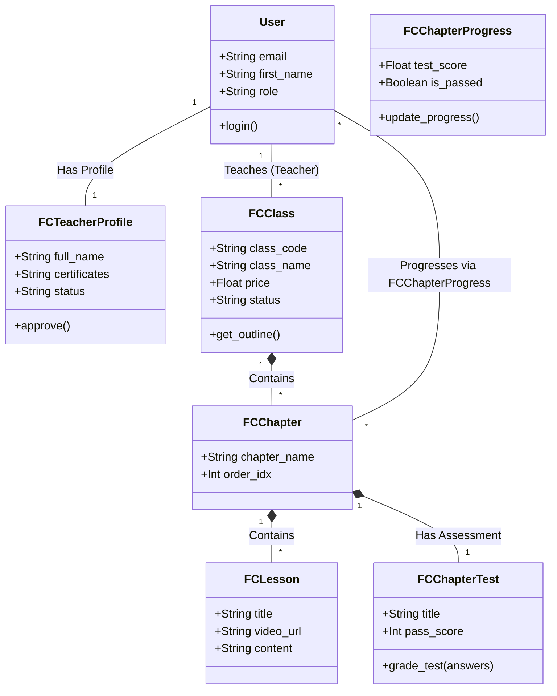

# Phân Tích Thiết Kế Hướng Đối Tượng (OOD) - Dự án Flying Class

Tài liệu này cung cấp cái nhìn chi tiết về Thiết kế Hướng đối tượng (Object-Oriented Design - OOD) của nền tảng học tập trực tuyến **Flying Class**. Dự án được xây dựng dựa trên Framework Frappe (Backend) và React (Frontend).

---

## 1. Tổng quan về Kiến trúc Hướng đối tượng

Trong Frappe, các "Đối tượng" (Objects) được mô phỏng dưới dạng **DocType**. Mỗi DocType đóng vai trò như một Lớp (Class) trong lập trình OOD, bao gồm các **Thuộc tính** (Fields/Properties) và các **Phương thức** (Methods/Controllers viết bằng Python). 

Các mối quan hệ giữa các đối tượng được thể hiện qua các con trỏ liên kết (Link fields - tương đương với Aggregation) và bảng con (Child Tables - tương đương với Composition).

---

## 2. Các Lớp Thực Thể (Entity Classes) Cốt Lõi

Dưới đây là các Lớp đối tượng chính cấu thành nên hệ thống:

### 2.1. Lớp Nền Tảng (Core Entities)

#### Lớp `User` (Kế thừa từ Frappe Core)
- **Vai trò:** Đại diện cho một tài khoản trong hệ thống.
- **Thuộc tính chính:** `email`, `first_name`, `last_name`, `role` (Vai trò).
- **Phân loại vai trò:** 
  - `FC Admin` (Quản trị viên)
  - `FC Teacher` (Giáo viên)
  - `FC Student` (Học sinh)

#### Lớp `FC Teacher Profile`
- **Vai trò:** Chứa thông tin hồ sơ chuyên môn của giáo viên (KYC).
- **Mối quan hệ:** Liên kết 1-1 với `User`.
- **Thuộc tính chính:** `full_name`, `identify_card` (CMND/CCCD), `certificates` (Chứng chỉ), `status` (Trạng thái duyệt).

---

### 2.2. Lớp Quản Lý Lớp Học & Cấu Trúc Khóa Học (Course Management)

#### Lớp `FC Class` (Lớp học)
- **Vai trò:** Đối tượng trung tâm quản lý một khóa học/lớp học.
- **Thuộc tính chính:** `class_code`, `class_name`, `price`, `description`, `status`.
- **Mối quan hệ:**
  - **Aggregation (Tập hợp):** Có 1 `teacher` (Giáo viên quản lý).
  - **Composition (Cấu thành):** Chứa danh sách `students` (Danh sách lớp `FC Class Member`).

#### Lớp `FC Class Member` (Thành viên lớp)
- **Vai trò:** Chi tiết kết nối giữa Học sinh và Lớp học (Bảng con).
- **Thuộc tính chính:** `student` (Link tới User), `join_date`, `is_muted`.

#### Lớp `FC Chapter` (Chương học)
- **Vai trò:** Nhóm các bài giảng lại với nhau theo chủ đề.
- **Thuộc tính chính:** `chapter_name`, `order_idx`.
- **Mối quan hệ:** Thuộc về 1 `FC Class`.

#### Lớp `FC Lesson` (Bài giảng)
- **Vai trò:** Nội dung chi tiết của một bài học.
- **Thuộc tính chính:** `title`, `video_url`, `content`, `document_url`.
- **Mối quan hệ:** Thuộc về 1 `FC Chapter`.

---

### 2.3. Lớp Đánh Giá & Kiểm Tra (Assessment Entities)

#### Lớp `FC Chapter Test` (Bài kiểm tra chương)
- **Vai trò:** Đánh giá năng lực của học sinh sau khi học xong một chương.
- **Thuộc tính chính:** `title`, `pass_score` (Điểm qua môn), `status`.
- **Mối quan hệ:** 
  - Gắn với 1 `FC Chapter`.
  - **Composition:** Chứa danh sách các `FC Question`.

#### Lớp `FC Question` (Câu hỏi trắc nghiệm)
- **Vai trò:** Thành phần của một bài kiểm tra.
- **Thuộc tính chính:** `question_text`, `option_a`, `option_b`, `option_c`, `option_d`, `correct_option`.

#### Lớp `FC Chapter Progress` (Tiến độ học tập)
- **Vai trò:** Lưu trữ kết quả học tập và trạng thái hoàn thành của học sinh.
- **Thuộc tính chính:** `test_score`, `is_passed`.
- **Mối quan hệ:** Liên kết giữa `User` (Học sinh) và `FC Chapter`.

---

### 2.4. Lớp Tương Tác & Lưu Trữ (Interaction & Storage)

#### Lớp `FC Message` (Tin nhắn Chat)
- **Vai trò:** Quản lý tin nhắn trao đổi trong phòng chat của lớp.
- **Thuộc tính chính:** `message`, `sender`, `creation` (Thời gian).
- **Mối quan hệ:** Gắn với một `FC Class`.

#### Lớp `FC Document` (Tài liệu / File)
- **Vai trò:** Quản lý kho tài nguyên, file ảnh, PDF do giáo viên tải lên.
- **Thuộc tính chính:** `folder_name`, `file_url`, `is_folder`, `parent_folder`.
- **Mối quan hệ:** Thuộc quyền sở hữu của `teacher`.

---

## 3. Phân tích Các Đặc Tính OOD (OOD Principles)

### 3.1. Tính Đóng Gói (Encapsulation)
- Backend (Frappe) đóng gói hoàn toàn logic tương tác với Database. 
- Frontend không trực tiếp thao tác với Database mà phải thông qua các **Interface** (APIs) được định nghĩa sẵn trong các file Controller của Frappe (VD: `api.py`).
- Thuộc tính của một lớp (DocType) được bảo vệ bằng hệ thống Phân quyền (Role-based Permissions). Chỉ `FC Teacher` mới có quyền `write` (Ghi) vào bài giảng, `FC Student` chỉ có quyền `read` (Đọc).

### 3.2. Tính Kế Thừa (Inheritance)
- **Tại Backend:** Mọi lớp thực thể (FC Class, FC Lesson, v.v.) đều kế thừa từ lớp cha `Document` của thư viện Frappe (`frappe.model.document.Document`). Lớp cha này cung cấp sẵn các phương thức cốt lõi như `.insert()`, `.save()`, `.delete()`, `.get_list()`.
- **Tại Frontend:** Các Component (UI) như Layout, Modal được kế thừa và tái sử dụng (Ví dụ: `CourseOutlineManager` và `StudentCourseOutline` đều có thể tận dụng chung các thành phần hiển thị Markdown `ReactMarkdown`).

### 3.3. Tính Đa Hình (Polymorphism)
- Phương thức truy xuất danh sách `get_course_outline` có tính đa hình dựa vào ngữ cảnh: Nếu người gọi API có vai trò (Role) là Học sinh, dữ liệu trả về sẽ đi kèm với tiến trình học tập (`FC Chapter Progress`). Nếu người gọi là Giáo viên, dữ liệu trả về tập trung vào thông tin chỉnh sửa bài kiểm tra và bài giảng.
- Cấu trúc cây thư mục của `FC Document` hỗ trợ đa hình đối tượng: Cùng một danh sách nhưng có đối tượng là `Folder` (Thư mục), có đối tượng là `File` (Tài liệu).

---

## 4. Biểu Đồ Lớp (Class Diagram - Mô tả khái quát)

## 5. Kết luận
Dự án **Flying Class** có kiến trúc hướng đối tượng rất rõ ràng, tuân thủ chặt chẽ mô hình Domain-Driven Design (DDD) của Frappe. Việc phân tách rành mạch giữa các Lớp Quản lý, Lớp Nội dung học và Lớp Đánh giá giúp hệ thống cực kỳ dễ bảo trì và dễ dàng mở rộng thêm các tính năng (VD: thêm ngân hàng đề thi chung, hoặc tích hợp AI) mà không làm phá vỡ logic cũ.
