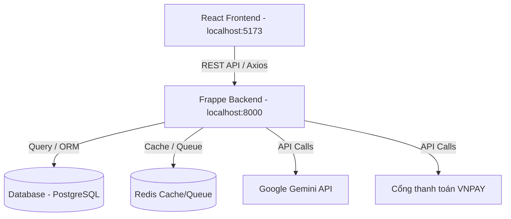

# 📄 Tóm Tắt Dự Án Flying Class (LMS & AI Assistant)

Tài liệu này cung cấp cái nhìn toàn cảnh về kiến trúc hệ thống, cấu trúc thư mục, danh sách các DocTypes (Cơ sở dữ liệu) và các tính năng chi tiết của hệ thống **Flying Class**.

---

## 1. 🏗️ Kiến Trúc Hệ Thống (System Architecture)

Hệ thống được thiết kế theo mô hình **Client-Server** hiện đại, tách biệt hoàn toàn giữa Frontend và Backend thông qua hệ thống RESTful API bảo mật.



### Chi tiết Stack công nghệ:
- **Frontend:** React 18, TypeScript, Vite, Tailwind CSS, Lucide Icons, Axios, Recharts (Biểu đồ thống kê).
- **Backend:** Frappe Framework v16 (Python), Gunicorn (Web Server), Werkzeug.
- **Database & Cache:** PostgreSQL (Lưu trữ quan hệ), Redis (Lưu cache, quản lý hàng đợi tác vụ nền, Realtime PubSub qua Socket.IO).
- **Trí tuệ nhân tạo:** Tích hợp Google Gemini (mô hình `gemini-2.0-flash`) thông qua thư viện `google-generativeai` để sinh đề thi và trò chuyện. Hệ thống tích hợp sẵn cơ chế **Mock Data Fallback** tự động trả về dữ liệu giả lập khi API Google bị quá tải (lỗi 429).
- **Thanh toán:** Tích hợp Cổng thanh toán VNPAY (sandbox) để mua các gói cước gia hạn AI.

---

## 2. 📂 Cấu Trúc Thư Mục Dự Án (Folder Structure)

```
Flying_Class/
├── backend/                       # Thư mục chứa Backend (Frappe Framework)
│   └── v16-bench/
│       ├── apps/
│       │   └── flying_class/     # Custom App cho dự án Flying Class
│       │       └── flying_class/
│       │           ├── flying_class/
│       │           │   ├── doctype/     # Định nghĩa các bảng dữ liệu (DocTypes)
│       │           │   ├── api.py       # API chính (Lớp học, Đề thi, Bảng điểm, Luyện thi)
│       │           │   ├── api_admin.py # API cho Quản trị viên (KYC, Cấu hình AI)
│       │           │   ├── api_auth.py  # API đăng ký, đăng nhập, OTP, Google OAuth
│       │           │   └── api_chat.py  # API quản lý các phiên chat cá nhân của Giáo viên
│       │           └── setup_core.py    # Script khởi tạo dữ liệu hệ thống lúc ban đầu
│       └── sites/
│           └── flyingclass.localhost/   # Cấu hình site và tệp đính kèm cục bộ
├── frontend/                      # Thư mục chứa Frontend (React/TypeScript)
│   ├── src/
│   │   ├── components/            # Các component dùng chung (Chat, Member, Popup...)
│   │   ├── hooks/                 # Custom Hooks quản lý Session, State
│   │   ├── pages/                 # Các màn hình chính (Dashboard, Login, ExamRoom...)
│   │   ├── services/              # Định nghĩa các cuộc gọi API (api.ts)
│   │   ├── store/                 # Quản lý State toàn cục bằng Zustand (Auth, Theme)
│   │   └── App.tsx                # Quản lý Router và phân quyền theo Role
│   ├── vite.config.ts
│   └── package.json
└── README.md                      # Hướng dẫn cài đặt dự án
```

---

## 3. 🗄️ Danh Sách DocTypes (Database Schema)

Dự án định nghĩa các DocType tùy chỉnh trên hệ thống Frappe để lưu trữ dữ liệu lớp học:

| Tên DocType | Mô tả | Các trường quan trọng |
| :--- | :--- | :--- |
| **FC Class** | Lớp học | `class_name`, `class_code`, `teacher` (Link User), `price`, `max_students`, `students` (Bảng con `FC Class Member`) |
| **FC Class Member** | Danh sách học sinh trong lớp | `student` (Link User), `join_date`, `is_muted` (0/1) |
| **FC Lesson** | Bài học/Bài giảng | `title`, `class_ref` (Link FC Class), `video_url`, `description` |
| **FC Document** | Tài liệu đính kèm lớp học | `document_name`, `class_ref`, `doc_type` (Folder/Link), `link_url`, `parent_folder` |
| **FC Exam** | Đề thi do giáo viên giao | `title`, `class_ref`, `duration`, `max_attempts`, `questions` (Bảng con `FC Question`) |
| **FC Question** | Câu hỏi trắc nghiệm | `question_text`, `option_a`, `option_b`, `option_c`, `option_d`, `correct_option` (A/B/C/D) |
| **FC Submission** | Bài thi đã nộp của học sinh | `exam_ref` (Link FC Exam), `student` (Link User), `answers_json`, `score`, `teacher_comment` |
| **FC Chat Message** | Tin nhắn thảo luận trong lớp | `class_ref`, `sender` (Link User), `message`, `is_teacher` (0/1) |
| **FC Teacher Profile** | Hồ sơ KYC của Giáo viên | `user`, `full_name`, `status` (Pending/Approved/Rejected), `cccd_number`, `phone`, `id_card_image`, `certificate_image` |
| **FC AI Subscription Order** | Đơn hàng mua gói AI | `teacher`, `package_type`, `amount`, `status` (Paid/Failed...), `payment_gateway` |

---

## 4. 🎛️ Các Phân Hệ & Chức Năng Chi Tiết (Functional Modules)

Dự án phân quyền người dùng thành 3 vai trò rõ rệt: **Giáo viên**, **Học sinh**, và **Quản trị viên**.

### 1. Phân hệ Giáo viên (Teacher Module)
- **KYC Hồ Sơ:** Khi đăng ký tài khoản Giáo viên, hệ thống bắt buộc gửi ảnh CCCD/Chứng minh nhân dân và Bằng cấp sư phạm lên Admin duyệt trước khi được tạo lớp.
- **Tạo & Quản lý Lớp học:** Quản lý học sinh tham gia bằng mã code, tắt chat học sinh gây mất trật tự, nhập nhanh danh sách học sinh hàng loạt từ file Excel.
- **Tạo Đề Thi & Quản lý Bài Kiểm tra:**
  - Giáo viên có thể tự nhập tay từng câu hỏi.
  - Sử dụng trợ lý **Gemini AI** để soạn đề kiểm tra nhanh chóng bằng cách đưa ra yêu cầu (Prompt) hoặc đính kèm tài liệu để AI tự trích xuất câu hỏi trắc nghiệm.
  - Thiết lập lịch thi tự động đóng/mở và số lượt thi tối đa cho từng bài.
- **Quản lý Tài liệu:** Tạo thư mục bài học, đính kèm link Drive, tài liệu nhúng Iframe trực quan cho học sinh đọc.
- **Bảng điểm (Gradebook) & Thống kê [MỚI]:** 
  - Xem bảng ma trận thống kê điểm cao nhất của từng học sinh đối với mỗi đầu điểm bài thi.
  - Xuất bảng điểm lớp học ra file CSV trực tiếp chỉ với một cú click chuột.
  - Theo dõi biểu đồ phân bố điểm số (Cột, Đường, Tròn) của học sinh để đánh giá mức độ tiếp thu bài học.
- **Quản lý AI (AI Management) [MỚI]:** Xem biểu đồ thống kê (Bar Chart) lượng Token AI đã tiêu thụ trong 7 ngày gần nhất để kiểm soát chi phí.

### 2. Phân hệ Học sinh (Student Module)
- **Giao diện Tổng quan:** Xem tổng số lớp học đã tham gia, biểu đồ tăng trưởng điểm số qua các kỳ kiểm tra gần nhất để tự đánh giá năng lực học tập.
- **Phòng Thi Chống Gian Lận (Exam Room):**
  - Giao diện làm bài toàn màn hình, ghi nhận thời gian bắt đầu và kết thúc làm bài.
  - Tích hợp hệ thống theo dõi hành vi: Nếu học sinh chuyển tab trình duyệt, nhấn F5, thu nhỏ màn hình hoặc mở công cụ nhà phát triển, hệ thống sẽ phát cảnh báo vi phạm. Số lần vi phạm sẽ được lưu trữ lại kèm bài làm thi để giáo viên đánh giá độ trung thực.
- **Realtime Chat:** Tham gia thảo luận bài học cùng các học sinh khác trong lớp, tin nhắn được đẩy tức thời (PubSub) thông qua Socket.IO.
- **AI Tự Luyện Đề (Practice Mode) [MỚI]:**
  - Tích hợp công cụ tự luyện đề AI không giới hạn chủ đề. Nếu hệ thống API Google bị quá tải do hết Quota (lỗi 429), AI sẽ kích hoạt chế độ **Mock Data**, tự động sinh đề giả lập để học sinh không bị gián đoạn trải nghiệm test UI.
  - Trải nghiệm làm bài thi thử có tính giờ, sau khi làm xong hệ thống sẽ hiển thị bảng điểm và so sánh chi tiết đáp án đúng/sai.
- **Trợ lý Tài liệu AI (Document Assistant) [MỚI]:** 
  - Khi học sinh đang mở đọc một tài liệu bất kỳ trong lớp học, có thể bấm nút "Hỏi AI".
  - Màn hình tự động chia làm đôi để hiển thị khung Sidebar Chat AI. AI sẽ tự động đọc nội dung tài liệu (file PDF cục bộ hoặc cào nội dung website ngoài) để làm ngữ cảnh trả lời tất cả các câu hỏi của học sinh về tài liệu đó.

### 3. Phân hệ Quản trị viên (Admin Module)
- **Duyệt Giáo viên:** Kiểm tra thông tin CCCD, bằng cấp sư phạm của giáo viên đăng ký để Approve hoặc Reject kèm lý do cụ thể.
- **Cấu hình API Key:** Lưu trữ và thay đổi API Key của Google Gemini và OpenAI để hệ thống chạy tính năng AI.
- **Kiểm soát Doanh thu & Đơn hàng:** Xem thống kê các lượt đăng ký mua gói AI của giáo viên bằng hình thức thanh toán VNPAY, phê duyệt các giao dịch thanh toán chuyển khoản thủ công.

---

## 5. 🔄 Quy Trình Nghiệp Vụ Chính (Key Workflows)

### Luồng Đăng ký & KYC Giáo viên
1. Người dùng Đăng ký tài khoản với vai trò "FC Teacher".
2. Hệ thống chuyển sang màn hình **TeacherKYC**.
3. Giáo viên bổ sung thông tin: Số CCCD, Ngày sinh, Số điện thoại, Ảnh CCCD, Ảnh bằng cấp sư phạm.
4. **Admin** duyệt hồ sơ:
   - Nếu **Approved**: Giáo viên được chuyển đến **TeacherDashboard** để bắt đầu tạo lớp và giảng dạy.
   - Nếu **Rejected**: Hiển thị lý do từ chối trên màn hình để giáo viên chỉnh sửa thông tin và nộp lại.

### Luồng Làm bài thi chống gian lận
1. Học sinh bấm **"Làm bài"** tại danh sách các bài thi đang mở.
2. Hệ thống ghi nhận `start_time` và kích hoạt chế độ giám sát sự kiện (`blur`, `visibilitychange`).
3. Học sinh làm bài. Nếu chuyển tab, cảnh báo vi phạm tăng thêm 1.
4. Bấm nộp bài hoặc hết giờ thi:
   - Tính số câu trả lời đúng/sai.
   - Ghi lại số lỗi vi phạm gian lận và gửi dữ liệu về lưu trữ tại `FC Submission` trên server.

### Luồng Luyện đề thi thử & Chat Tài liệu AI
1. Học sinh gửi yêu cầu luyện đề hoặc câu hỏi về tài liệu lên hệ thống.
2. Backend kiểm tra số lượt dùng thử AI còn lại (`custom_ai_trial_messages_used` < 10) hoặc thời hạn đăng ký gói AI của tài khoản học sinh.
3. Nếu hợp lệ:
   - Gửi yêu cầu kèm tệp/đường dẫn đến Gemini API.
   - Trả về câu hỏi trắc nghiệm hoặc câu trả lời tóm tắt tài liệu.
   - Tăng số lượt sử dụng AI lên 1 hoặc ghi nhận lượng token sử dụng vào bảng `FC AI Token Usage`.
4. Nếu hết lượt sử dụng miễn phí:
   - Hệ thống hiển thị bảng giá (AI Pricing Modal) yêu cầu nâng cấp gói cước qua VNPAY để tiếp tục sử dụng.
